# Slowness and glitch review — 2026-10-05 23:26 ET (manual run)

**RED — 7 red · 46 amber** across 21 screens · GitHub Actions (cloud) run 37408912338 · [the run](https://github.com/aharveyrianhard-stack/scintilla-hub/actions/runs/37408912338) · compared with 2026-10-05 23:15 ET

It measures and ranks; it fixes nothing. What each number means and when it is listed: PAGE SPECS at the foot of `index.html` (same folder).

## Worst five

1. Hub · board · things jump around on a slow phone · layout shift 0.91 in Lighthouse's slow-phone load (good is under 0.10) · last run 0.89
2. Allocation tool · things jump around while it loads · layout shift 0.50 (good is under 0.10) · last run 0.49
3. Hub · board · low Lighthouse speed score · 10 out of 100 on a phone (biggest paint at 12 s) · last run 10
4. Allocation tool · low Lighthouse speed score · 29 out of 100 on a phone (biggest paint at 8.4 s) · last run 30
5. Hub · social · heavy to download · 6.2 MB downloaded · last run 6.2 MB

## The numbers

| screen | result | first numbers | weight | layout shift | longest freeze | log errors | failed calls | dashes | blank boxes | old labels | picture changed | Lighthouse speed |
|---|---|---|---|---|---|---|---|---|---|---|---|---|
| Hub · board | RED | 0.4 s | 2.4 MB | 0.07 | 0.3 s | 0 | 0 | 5 | 0 | 1 | 0 % | 10 |
| Hub · news | amber | 0.7 s | 276 KB | 0.02 | 0.3 s | 0 | 0 | 0 | 0 | 0 | 4 % | · |
| Hub · social | RED | 0.7 s | 6.2 MB | 0.02 | 0.3 s | 0 | 0 | 0 | 0 | 1 | 0 % | · |
| Hub · sentiment | amber | 2.2 s | 4.8 MB | 0.02 | 0.7 s | 2 | 2 | 0 | 0 | 0 | 0 % | · |
| Hub · alerts | amber | never | 990 KB | 0.02 | 0.3 s | 0 | 0 | 0 | 0 | 0 | 0 % | · |
| Hub · screener | amber | never | 961 KB | 0.02 | 0.3 s | 0 | 0 | 0 | 0 | 0 | 0 % | · |
| Hub · earnings | amber | 0.6 s | 734 KB | 0.02 | 0.3 s | 0 | 0 | 3 | 0 | 0 | 0 % | · |
| Hub · usual day | amber | 0.8 s | 445 KB | 0.02 | 0.3 s | 0 | 0 | 0 | 0 | 0 | 0 % | · |
| Hub · economic | amber | 0.5 s | 259 KB | 0.02 | 0.3 s | 0 | 0 | 17 | 0 | 0 | 0 % | · |
| Hub · company view NVDA | amber | 0.4 s | 972 KB | 0.08 | 0.3 s | 0 | 0 | 5 | 0 | 0 | 0 % | · |
| Hub · company view BRK-B | amber | 0.4 s | 964 KB | 0.06 | 0.3 s | 0 | 0 | 5 | 0 | 0 | 0 % | · |
| Hub · company view BTCUSD | amber | 0.6 s | 694 KB | 0.05 | 0.3 s | 2 | 2 | 5 | 0 | 3 | 0 % | · |
| Station · deck | amber | 0.2 s | 2.7 MB | 0.04 | 0.1 s | 0 | 0 | 0 | 0 | 1 | 0 % | 96 |
| Station · chart | amber | 0.8 s | 190 KB | 0.00 | 0.4 s | 0 | 0 | 0 | 0 | 0 | 0 % | 96 |
| Allocation tool | RED | 6.5 s | 944 KB | 0.50 | 0.5 s | 1 | 1 | 0 | 0 | 4 | 8 % | 29 |
| Tree preview | ok | 0.6 s | 756 KB | 0.02 | 0.2 s | 0 | 0 | 0 | 0 | 0 | 0 % | 96 |
| Hub · board (phone width) | amber | 0.3 s | 2.4 MB | 0.02 | 0.3 s | 0 | 0 | 0 | 0 | 0 | 0 % | · |
| Station · deck (phone width) | amber | 0.6 s | 2.5 MB | 0.00 | 0.1 s | 0 | 0 | 0 | 0 | 3 | 0 % | · |
| Station · chart (phone width) | amber | 0.2 s | 190 KB | 0.00 | 0.0 s | 0 | 0 | 0 | 0 | 1 | 0 % | · |
| Allocation tool (phone width) | RED | 4.9 s | 945 KB | 0.31 | 0.5 s | 1 | 1 | 0 | 0 | 4 | 2 % | · |
| Tree preview (phone width) | ok | 0.3 s | 325 KB | 0.00 | 0.0 s | 0 | 0 | 0 | 0 | 0 | 0 % | · |

## The full ranked list (53)

1. **RED** Hub · board · things jump around on a slow phone · layout shift 0.91 in Lighthouse's slow-phone load (good is under 0.10) · last run 0.89
2. **RED** Allocation tool · things jump around while it loads · layout shift 0.50 (good is under 0.10) · last run 0.49
3. **RED** Hub · board · low Lighthouse speed score · 10 out of 100 on a phone (biggest paint at 12 s) · last run 10
4. **RED** Allocation tool · low Lighthouse speed score · 29 out of 100 on a phone (biggest paint at 8.4 s) · last run 30
5. **RED** Hub · social · heavy to download · 6.2 MB downloaded · last run 6.2 MB
6. **RED** Allocation tool (phone width) · things jump around while it loads · layout shift 0.31 (good is under 0.10) · last run 0.31
7. **RED** Allocation tool · things jump around on a slow phone · layout shift 0.29 in Lighthouse's slow-phone load (good is under 0.10) · last run 0.29
8. amber Hub · sentiment · heavy to download · 4.8 MB downloaded · last run 4.8 MB
9. amber Allocation tool · old, stale or fallback data on show · 4 labels (oldest 3 days) — e.g. “market_breadth · FALLBACK” · last run 4
10. amber Allocation tool (phone width) · old, stale or fallback data on show · 4 labels (oldest 3 days) — e.g. “market_breadth · FALLBACK” · last run 4
11. amber Hub · sentiment · the screen freezes · longest freeze 0.7 s (9 stalls, 2.0 s frozen in all) · last run 0.9 s
12. amber Allocation tool · slow to show its numbers · 6.5 s until the first numbers appeared · last run 8.2 s
13. amber Hub · company view BTCUSD · old, stale or fallback data on show · 3 labels — e.g. “unavailable” · last run 3
14. amber Station · deck (phone width) · old, stale or fallback data on show · 3 labels — e.g. “X source is offline” · last run 1
15. amber Station · deck · heavy to download · 2.7 MB downloaded · last run 2.6 MB
16. amber Allocation tool (phone width) · the screen freezes · longest freeze 0.5 s (1 stall, 0.5 s frozen in all) · last run 0.5 s
17. amber Allocation tool · the screen freezes · longest freeze 0.5 s (1 stall, 0.5 s frozen in all) · last run 0.5 s
18. amber Station · deck (phone width) · heavy to download · 2.5 MB downloaded · last run 2.5 MB
19. amber Hub · board · heavy to download · 2.4 MB downloaded · last run 2.4 MB
20. amber Hub · board (phone width) · heavy to download · 2.4 MB downloaded · last run 2.5 MB
21. amber Allocation tool (phone width) · slow to show its numbers · 4.9 s until the first numbers appeared · last run 6.1 s
22. amber Hub · economic · dashes where numbers should be · 17 empty readouts (“—”) on screen · last run 17
23. amber Station · chart · the screen freezes · longest freeze 0.4 s (1 stall, 0.3 s frozen in all) · last run 0.0 s
24. amber Hub · news · the screen freezes · longest freeze 0.3 s (4 stalls, 0.5 s frozen in all) · last run 0.3 s
25. amber Hub · social · the screen freezes · longest freeze 0.3 s (9 stalls, 0.5 s frozen in all) · last run 0.3 s
26. amber Hub · company view BRK-B · the screen freezes · longest freeze 0.3 s (7 stalls, 0.5 s frozen in all) · last run 0.3 s
27. amber Hub · earnings · the screen freezes · longest freeze 0.3 s (10 stalls, 0.5 s frozen in all) · last run 0.3 s
28. amber Hub · usual day · the screen freezes · longest freeze 0.3 s (8 stalls, 0.5 s frozen in all) · last run 0.3 s
29. amber Hub · board (phone width) · the screen freezes · longest freeze 0.3 s (9 stalls, 0.9 s frozen in all) · last run 0.3 s
30. amber Hub · economic · the screen freezes · longest freeze 0.3 s (5 stalls, 0.7 s frozen in all) · last run 0.3 s
31. amber Hub · alerts · the screen freezes · longest freeze 0.3 s (4 stalls, 0.4 s frozen in all) · last run 0.3 s
32. amber Hub · board · the screen freezes · longest freeze 0.3 s (9 stalls, 1.0 s frozen in all) · last run 0.3 s
33. amber Hub · company view BTCUSD · the screen freezes · longest freeze 0.3 s (5 stalls, 0.4 s frozen in all) · last run 0.3 s
34. amber Hub · screener · the screen freezes · longest freeze 0.3 s (4 stalls, 0.4 s frozen in all) · last run 0.3 s
35. amber Hub · company view NVDA · the screen freezes · longest freeze 0.3 s (5 stalls, 0.4 s frozen in all) · last run 0.3 s
36. amber Hub · board · old, stale or fallback data on show · 1 label — e.g. “equities · MASSIVE · market closed · 500 sta” · last run 1
37. amber Hub · social · old, stale or fallback data on show · 1 label — e.g. “· 194 channel feeds not answering” · last run 1
38. amber Hub · sentiment · data calls that failed · 2 failed calls (most often: 400 scintilla-massive-chart-api.fly.dev/quotes) · last run 2
39. amber Hub · alerts · the room is parked — it shows no data · a notice instead of numbers
40. amber Hub · screener · the room is parked — it shows no data · a notice instead of numbers
41. amber Hub · company view BTCUSD · data calls that failed · 2 failed calls (most often: 404 scintilla-massive-chart-api.fly.dev/candles) · last run 2
42. amber Station · deck · old, stale or fallback data on show · 1 label — e.g. “X source is offline” · last run 1
43. amber Station · chart (phone width) · old, stale or fallback data on show · 1 label — e.g. “+0.41 — older than this source normally is -” · last run 0
44. amber Hub · board · dashes where numbers should be · 5 empty readouts (“—”) on screen · last run 5
45. amber Hub · company view NVDA · dashes where numbers should be · 5 empty readouts (“—”) on screen · last run 5
46. amber Hub · company view BRK-B · dashes where numbers should be · 5 empty readouts (“—”) on screen · last run 5
47. amber Hub · company view BTCUSD · dashes where numbers should be · 5 empty readouts (“—”) on screen · last run 5
48. amber Allocation tool · data calls that failed · 1 failed call (most often: 404 wadinxqplrggagkvrdag.supabase.co/rest/v1/market_breadth) · last run 1
49. amber Allocation tool (phone width) · data calls that failed · 1 failed call (most often: 404 wadinxqplrggagkvrdag.supabase.co/rest/v1/market_breadth) · last run 1
50. amber Hub · sentiment · errors in the browser's log · 2 errors · last run 2
51. amber Hub · company view BTCUSD · errors in the browser's log · 2 errors · last run 2
52. amber Allocation tool · errors in the browser's log · 1 error · last run 1
53. amber Allocation tool (phone width) · errors in the browser's log · 1 error · last run 1

## Every screen, as the review saw it

### Hub · board — RED

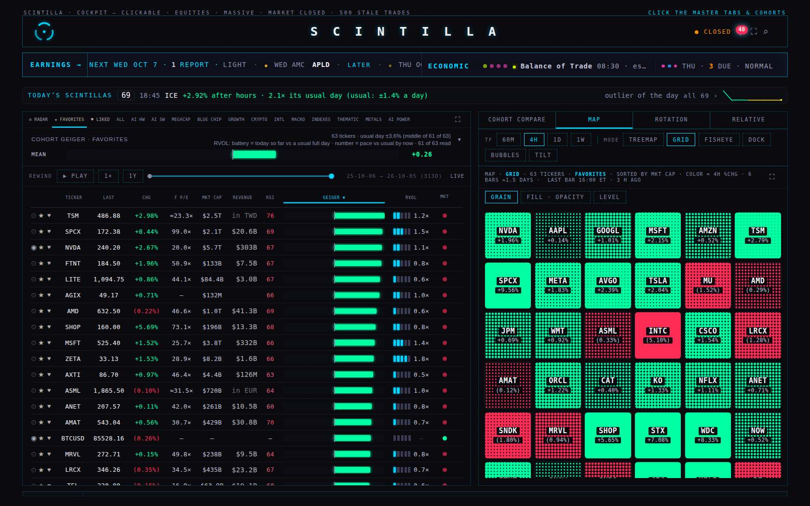

- **RED** things jump around on a slow phone — layout shift 0.91 in Lighthouse's slow-phone load (good is under 0.10) (last run 0.89)
- **RED** low Lighthouse speed score — 10 out of 100 on a phone (biggest paint at 12 s) (last run 10)
- amber heavy to download — 2.4 MB downloaded (last run 2.4 MB)
- amber the screen freezes — longest freeze 0.3 s (9 stalls, 1.0 s frozen in all) (last run 0.3 s)
- amber old, stale or fallback data on show — 1 label — e.g. “equities · MASSIVE · market closed · 500 sta” (last run 1)
- amber dashes where numbers should be — 5 empty readouts (“—”) on screen (last run 5)
- what moved since the last run: 0.1 % of the screen — [the difference picture](shots/hub-dashboard.moved.png)

### Hub · news — amber

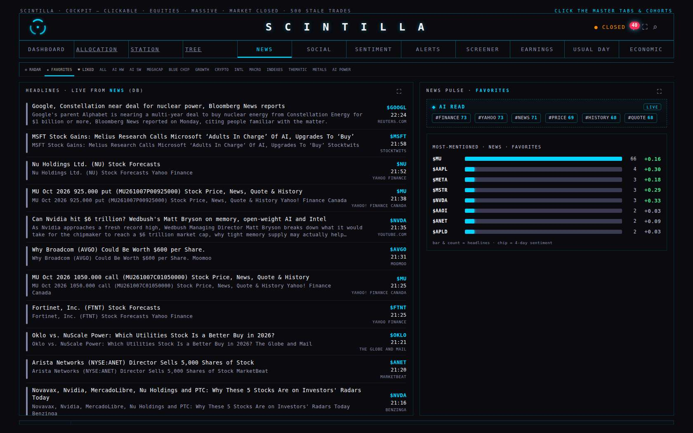

- amber the screen freezes — longest freeze 0.3 s (4 stalls, 0.5 s frozen in all) (last run 0.3 s)
- what moved since the last run: 4.3 % of the screen — [the difference picture](shots/hub-news.moved.png)

### Hub · social — RED

- **RED** heavy to download — 6.2 MB downloaded (last run 6.2 MB)
- amber the screen freezes — longest freeze 0.3 s (9 stalls, 0.5 s frozen in all) (last run 0.3 s)
- amber old, stale or fallback data on show — 1 label — e.g. “· 194 channel feeds not answering” (last run 1)
- what moved since the last run: 0.1 % of the screen — [the difference picture](shots/hub-social.moved.png)

### Hub · sentiment — amber

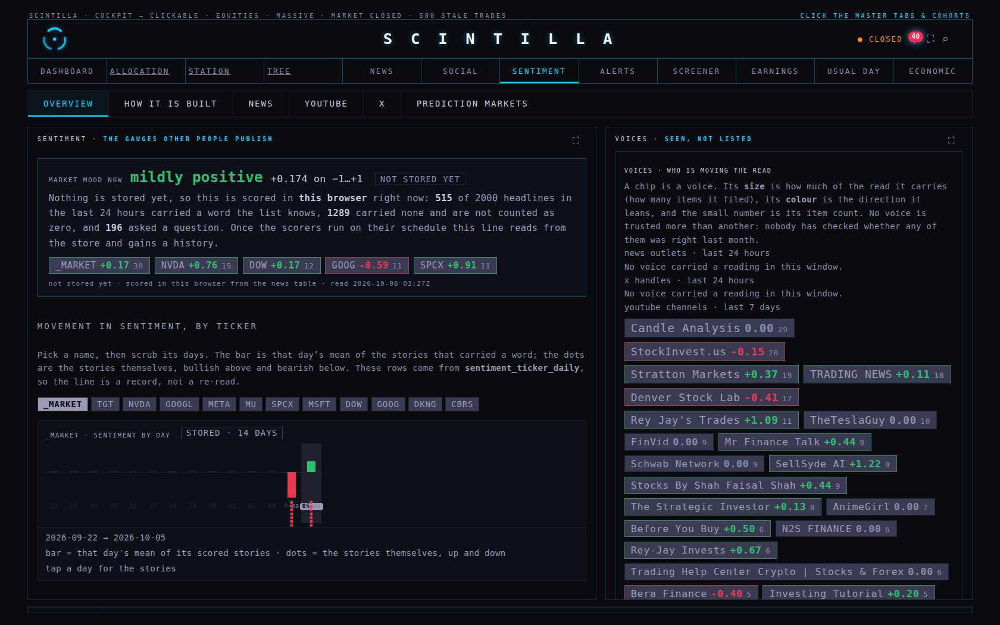

- amber heavy to download — 4.8 MB downloaded (last run 4.8 MB)
- amber the screen freezes — longest freeze 0.7 s (9 stalls, 2.0 s frozen in all) (last run 0.9 s)
- amber data calls that failed — 2 failed calls (most often: 400 scintilla-massive-chart-api.fly.dev/quotes) (last run 2)
- amber errors in the browser's log — 2 errors (last run 2)
- what moved since the last run: 0.2 % of the screen — [the difference picture](shots/hub-sentiment.moved.png)

### Hub · alerts — amber

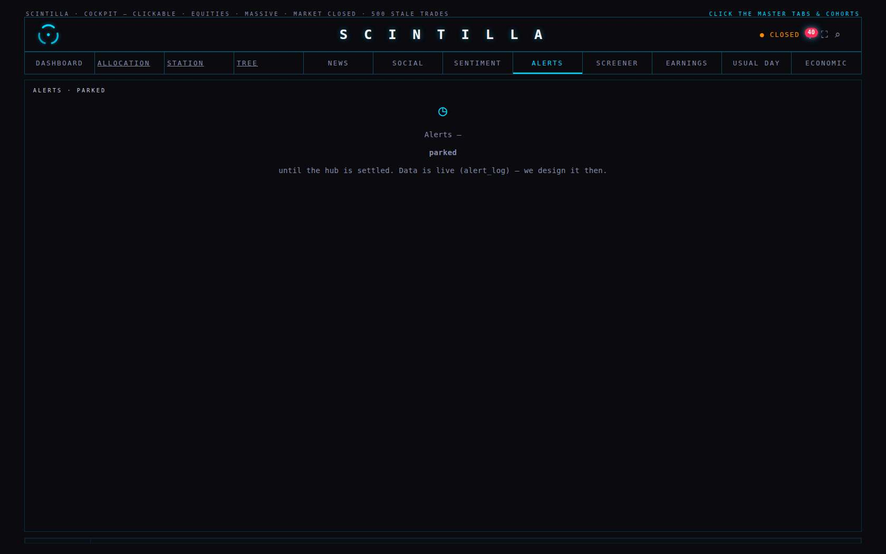

- amber the screen freezes — longest freeze 0.3 s (4 stalls, 0.4 s frozen in all) (last run 0.3 s)
- amber the room is parked — it shows no data — a notice instead of numbers
- what moved since the last run: 0.0 % of the screen — [the difference picture](shots/hub-alerts.moved.png)

### Hub · screener — amber

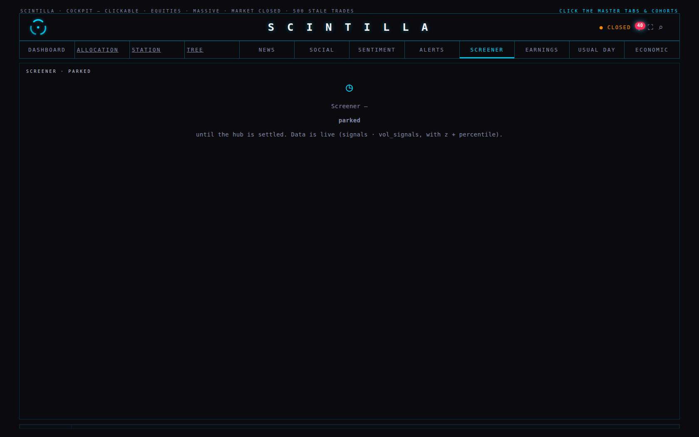

- amber the screen freezes — longest freeze 0.3 s (4 stalls, 0.4 s frozen in all) (last run 0.3 s)
- amber the room is parked — it shows no data — a notice instead of numbers
- what moved since the last run: 0.0 % of the screen — [the difference picture](shots/hub-screener.moved.png)

### Hub · earnings — amber

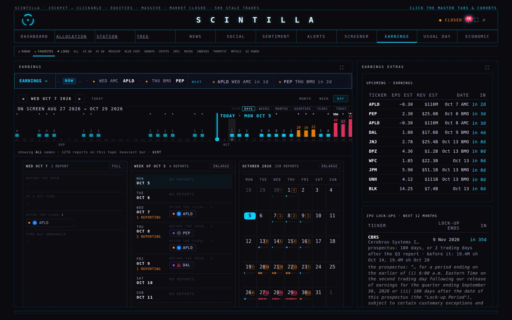

- amber the screen freezes — longest freeze 0.3 s (10 stalls, 0.5 s frozen in all) (last run 0.3 s)
- what moved since the last run: 0.0 % of the screen — [the difference picture](shots/hub-events.moved.png)

### Hub · usual day — amber

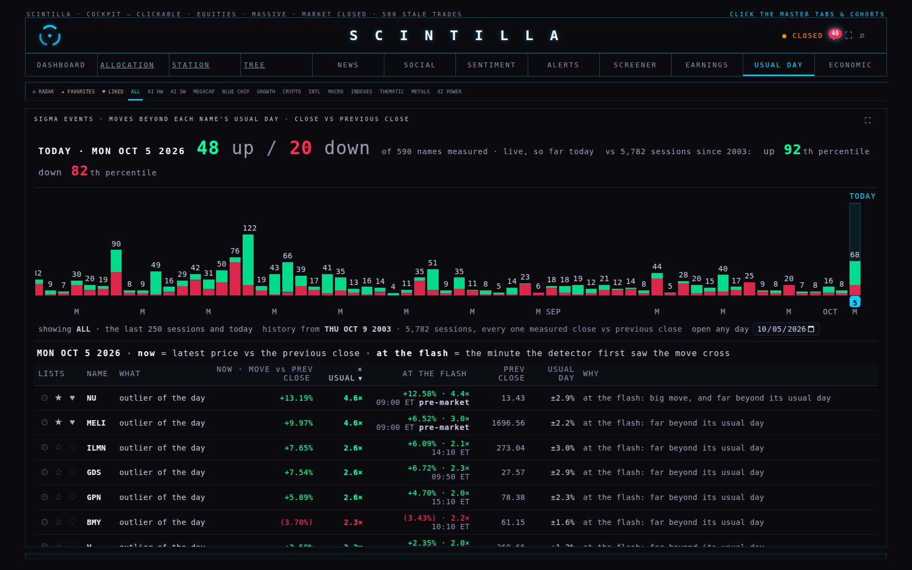

- amber the screen freezes — longest freeze 0.3 s (8 stalls, 0.5 s frozen in all) (last run 0.3 s)
- what moved since the last run: 0.0 % of the screen — [the difference picture](shots/hub-usual.moved.png)

### Hub · economic — amber

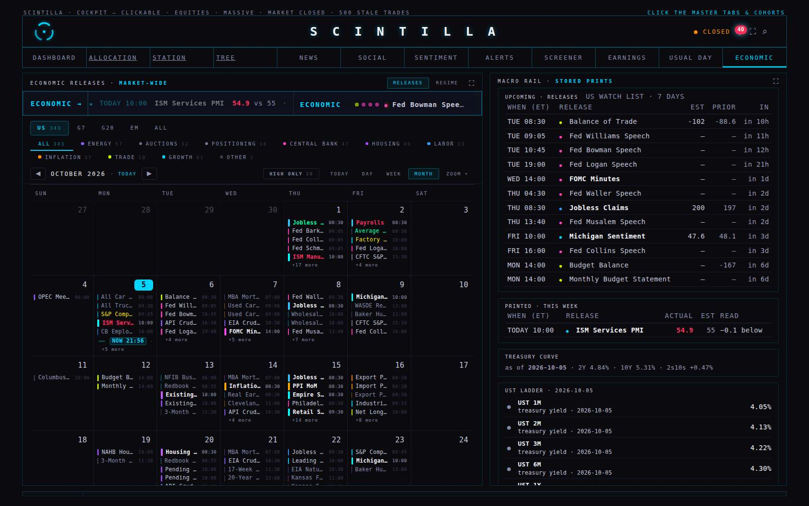

- amber dashes where numbers should be — 17 empty readouts (“—”) on screen (last run 17)
- amber the screen freezes — longest freeze 0.3 s (5 stalls, 0.7 s frozen in all) (last run 0.3 s)
- what moved since the last run: 0.1 % of the screen — [the difference picture](shots/hub-economic.moved.png)

### Hub · company view NVDA — amber

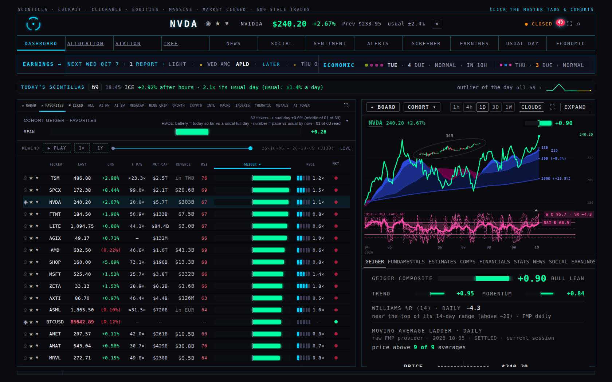

- amber the screen freezes — longest freeze 0.3 s (5 stalls, 0.4 s frozen in all) (last run 0.3 s)
- amber dashes where numbers should be — 5 empty readouts (“—”) on screen (last run 5)
- what moved since the last run: 0.1 % of the screen — [the difference picture](shots/hub-company-nvda.moved.png)

### Hub · company view BRK-B — amber

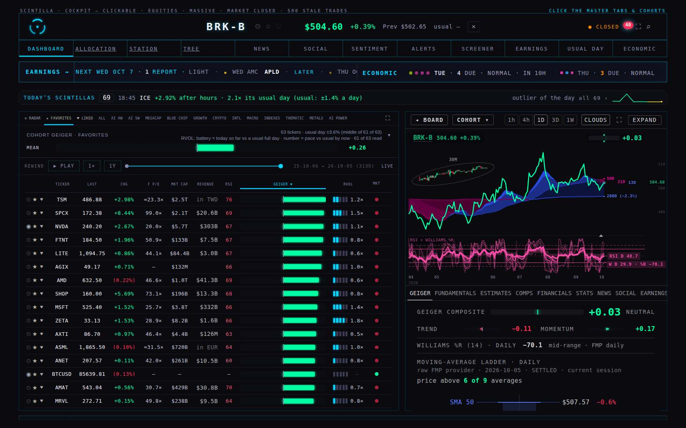

- amber the screen freezes — longest freeze 0.3 s (7 stalls, 0.5 s frozen in all) (last run 0.3 s)
- amber dashes where numbers should be — 5 empty readouts (“—”) on screen (last run 5)
- what moved since the last run: 0.1 % of the screen — [the difference picture](shots/hub-company-brk-b.moved.png)

### Hub · company view BTCUSD — amber

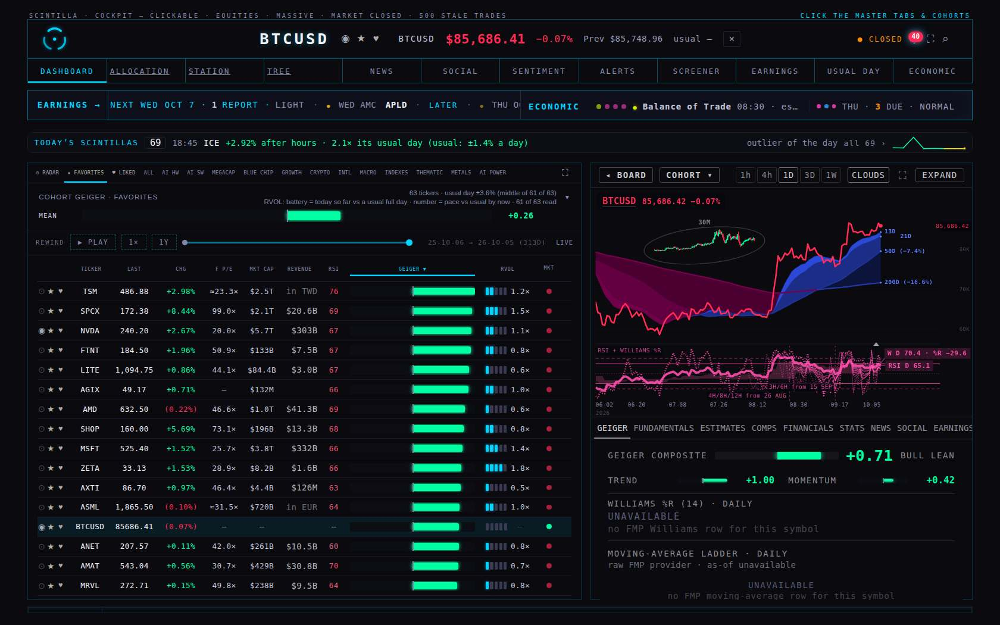

- amber old, stale or fallback data on show — 3 labels — e.g. “unavailable” (last run 3)
- amber the screen freezes — longest freeze 0.3 s (5 stalls, 0.4 s frozen in all) (last run 0.3 s)
- amber data calls that failed — 2 failed calls (most often: 404 scintilla-massive-chart-api.fly.dev/candles) (last run 2)
- amber dashes where numbers should be — 5 empty readouts (“—”) on screen (last run 5)
- amber errors in the browser's log — 2 errors (last run 2)
- what moved since the last run: 0.1 % of the screen — [the difference picture](shots/hub-company-btcusd.moved.png)

### Station · deck — amber

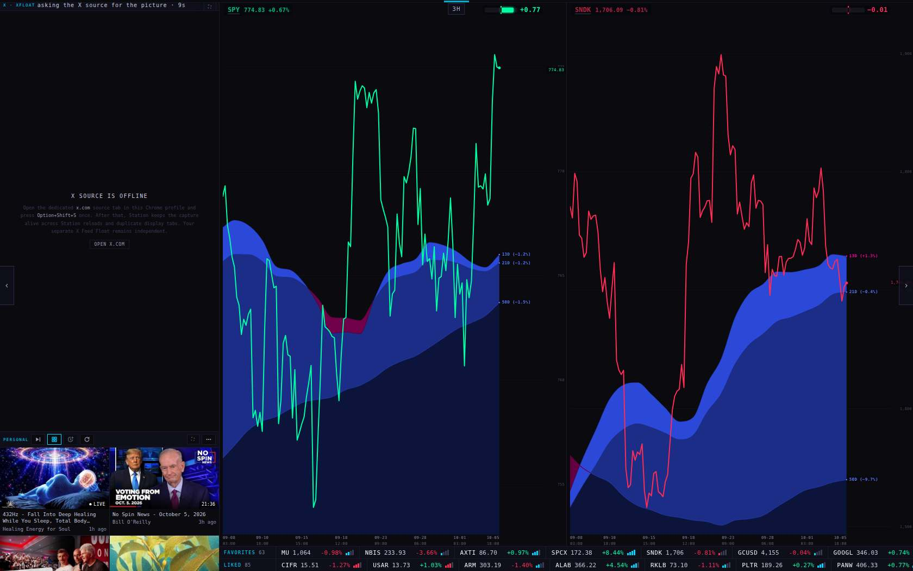

- amber heavy to download — 2.7 MB downloaded (last run 2.6 MB)
- amber old, stale or fallback data on show — 1 label — e.g. “X source is offline” (last run 1)
- what moved since the last run: 0.0 % of the screen — [the difference picture](shots/station-deck.moved.png)

### Station · chart — amber

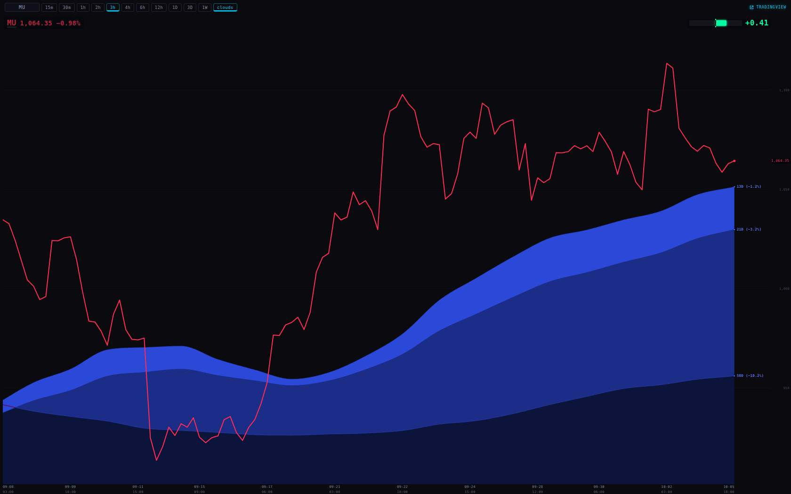

- amber the screen freezes — longest freeze 0.4 s (1 stall, 0.3 s frozen in all) (last run 0.0 s)
- what moved since the last run: 0.0 % of the screen — [the difference picture](shots/station-chart.moved.png)

### Allocation tool — RED

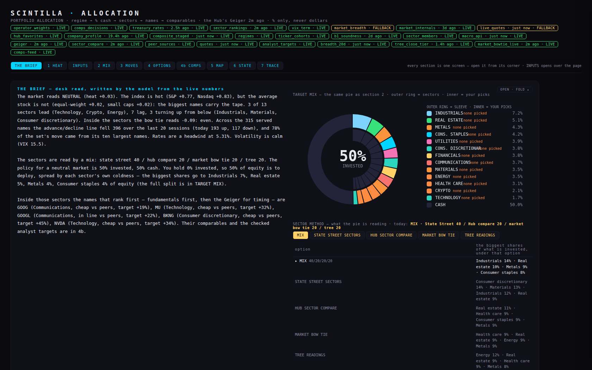

- **RED** things jump around while it loads — layout shift 0.50 (good is under 0.10) (last run 0.49)
- **RED** low Lighthouse speed score — 29 out of 100 on a phone (biggest paint at 8.4 s) (last run 30)
- **RED** things jump around on a slow phone — layout shift 0.29 in Lighthouse's slow-phone load (good is under 0.10) (last run 0.29)
- amber old, stale or fallback data on show — 4 labels (oldest 3 days) — e.g. “market_breadth · FALLBACK” (last run 4)
- amber slow to show its numbers — 6.5 s until the first numbers appeared (last run 8.2 s)
- amber the screen freezes — longest freeze 0.5 s (1 stall, 0.5 s frozen in all) (last run 0.5 s)
- amber data calls that failed — 1 failed call (most often: 404 wadinxqplrggagkvrdag.supabase.co/rest/v1/market_breadth) (last run 1)
- amber errors in the browser's log — 1 error (last run 1)
- what moved since the last run: 8.3 % of the screen — [the difference picture](shots/allocation.moved.png)

### Tree preview — ok

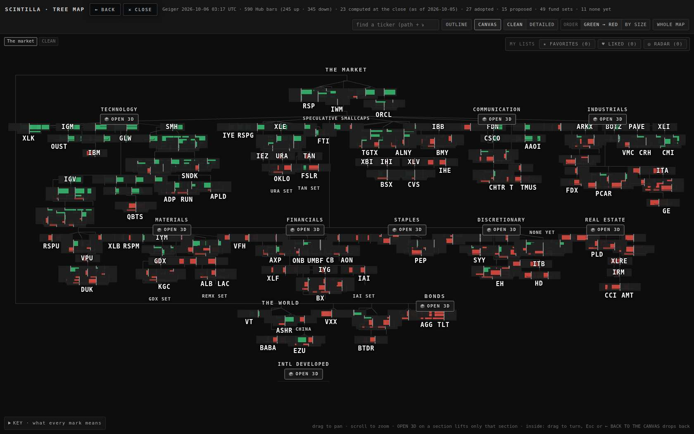

- nothing past its limit
- what moved since the last run: 0.0 % of the screen — [the difference picture](shots/tree.moved.png)

### Hub · board (phone width) — amber

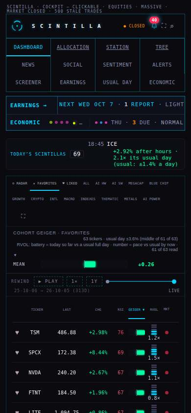

- amber heavy to download — 2.4 MB downloaded (last run 2.5 MB)
- amber the screen freezes — longest freeze 0.3 s (9 stalls, 0.9 s frozen in all) (last run 0.3 s)
- what moved since the last run: 0.0 % of the screen — [the difference picture](shots/hub-dashboard-phone.moved.png)

### Station · deck (phone width) — amber

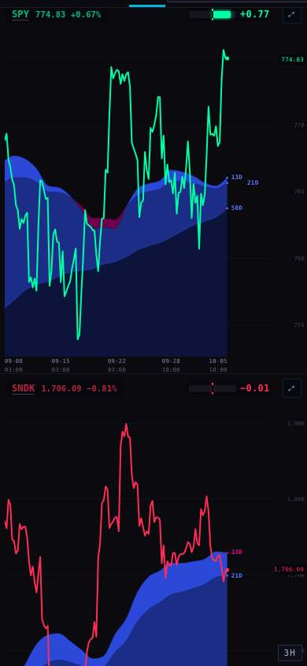

- amber old, stale or fallback data on show — 3 labels — e.g. “X source is offline” (last run 1)
- amber heavy to download — 2.5 MB downloaded (last run 2.5 MB)
- what moved since the last run: 0.1 % of the screen — [the difference picture](shots/station-deck-phone.moved.png)

### Station · chart (phone width) — amber

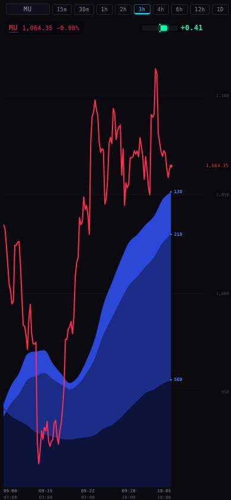

- amber old, stale or fallback data on show — 1 label — e.g. “+0.41 — older than this source normally is -” (last run 0)
- what moved since the last run: 0.1 % of the screen — [the difference picture](shots/station-chart-phone.moved.png)

### Allocation tool (phone width) — RED

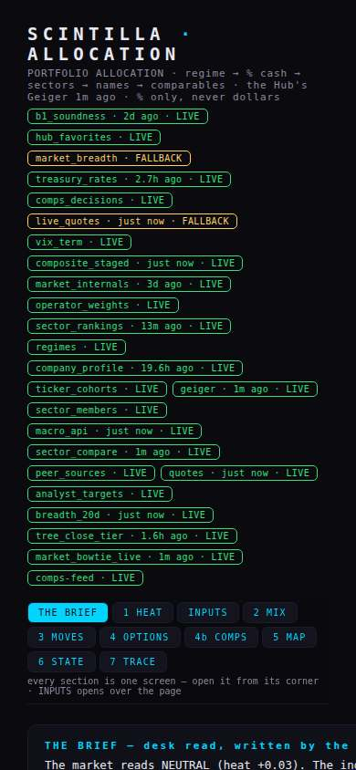

- **RED** things jump around while it loads — layout shift 0.31 (good is under 0.10) (last run 0.31)
- amber old, stale or fallback data on show — 4 labels (oldest 3 days) — e.g. “market_breadth · FALLBACK” (last run 4)
- amber the screen freezes — longest freeze 0.5 s (1 stall, 0.5 s frozen in all) (last run 0.5 s)
- amber slow to show its numbers — 4.9 s until the first numbers appeared (last run 6.1 s)
- amber data calls that failed — 1 failed call (most often: 404 wadinxqplrggagkvrdag.supabase.co/rest/v1/market_breadth) (last run 1)
- amber errors in the browser's log — 1 error (last run 1)
- what moved since the last run: 2.4 % of the screen — [the difference picture](shots/allocation-phone.moved.png)

### Tree preview (phone width) — ok

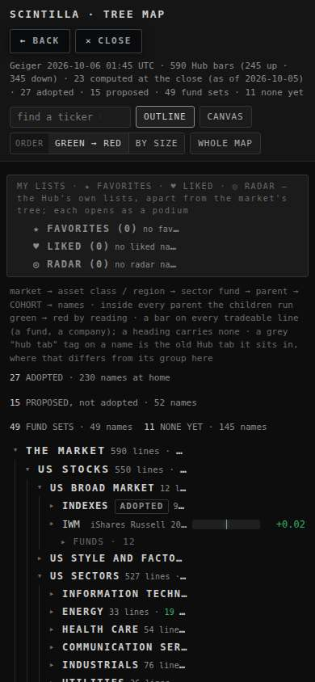

- nothing past its limit
- what moved since the last run: 0.0 % of the screen — [the difference picture](shots/tree-phone.moved.png)
